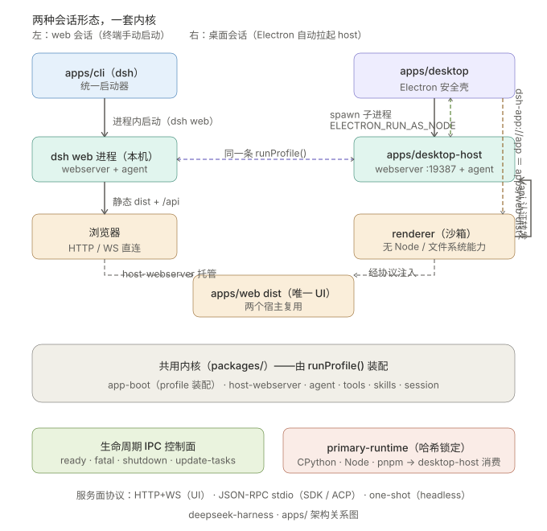
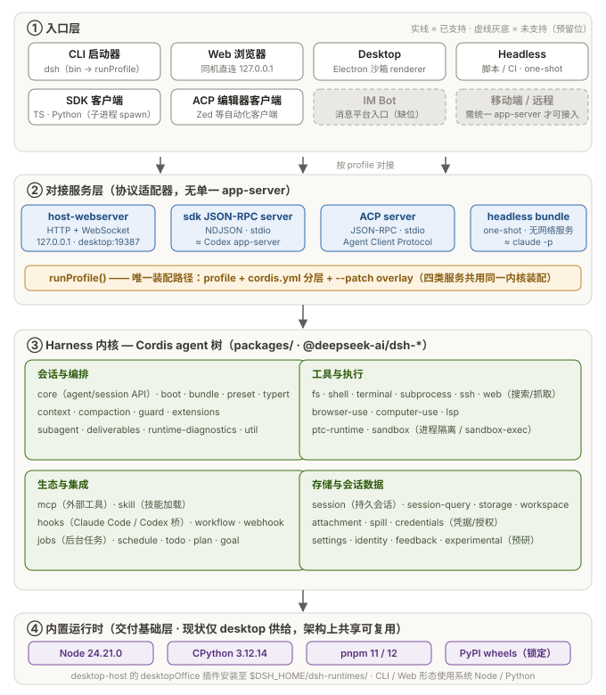

# apps/ 四应用架构：cli · desktop · desktop-host · web

> 源码设计分析笔记（单语维护，不承担 docs/ 的双语配对契约）。引用提交请用 tag 或 PR 链接，勿写裸 commit 哈希（repository-references 门禁）。

## 总览

一套 Cordis agent 内核，四种外壳复用：`apps/cli` 是统一启动器，`apps/web` 是唯一的前端 UI，`apps/desktop` 是 Electron 安全壳，`apps/desktop-host` 是把同一套 agent 树以 headless 方式跑在 Electron 里的 Node 子进程；四个应用不实现业务逻辑，全部是围绕 `packages/` 内核的装配与交付层。



### 分层全景

按"入口层 → 对接服务层 → harness 内核 → 内置运行时"的分层视角：



- **入口层**：CLI、Web、Desktop、Headless、SDK、ACP 六类已支持；IM Bot、移动端/远程为虚线灰底预留位（缺统一 app-server，暂无法接入）。
- **对接服务层**：无单一 app-server，四个协议适配器（HTTP+WS / NDJSON-stdio / JSON-RPC-stdio / one-shot）全部经由同一条 `runProfile()` 装配路径复用内核。
- **harness 内核**：Cordis agent 树的模块分组——会话与编排、工具与执行、生态与集成（mcp/skill/hooks 等）、存储与会话数据。
- **内置运行时**：primary-runtime（Node/CPython/pnpm/wheels，sha256 锁定）随桌面交付；CLI/Web 形态用系统运行时。

两种会话形态的进程与请求拓扑：

```
Web session:
  dsh web (CLI process, local)
    |- Cordis tree: webserver (127.0.0.1:<port>) + agent + plugins
    '- browser -- HTTP/WS --> same process, apps/web dist + /api

Desktop session:
  Electron main (apps/desktop main.ts)
    |- renderer (sandboxed) -- dsh-app://app = apps/web dist
    |    '- /api -- auth cookie --> 127.0.0.1:19387
    '- desktop-host child (ELECTRON_RUN_AS_NODE, IPC fd)
         '- runProfile('desktop'): webserver:19387 + agent + plugins
```

### 运行时的归属：不是第四层，是交付基础层

请求链路不经过运行时（入口 → 服务适配 → 内核即闭环），所以严格说模型是 **3 层 + 1 个垂直基础层**。运行时的"仅 desktop"是**实现现状而非架构约束**：

- **现状**：全仓只有 `apps/desktop/scripts/prepare-primary-runtime.ts` 做供给，唯一消费点是 desktop-host（`desktop-host/src/index.ts:71` 的 `desktopOffice` 插件，装入 `resolveDshHome()/dsh-runtimes/`，即 `$DSH_HOME` 或 `~/.dsh`）。`apps/cli` 零运行时供给逻辑，用系统 Node/Python。
- **合理性**：desktop 面向终端用户，不能假设机器上有 Node/Python，且要求离线可装、sha256 可复现——自带运行时是必要条件；CLI/web/SDK/ACP/headless 面向开发者与自动化，环境里本来就有 Node（否则装不了 dsh），捆绑反而拖慢安装。
- **代价**：同一 agent 两种形态能力不一致——desktop 里 Python 技能用的锁定 CPython 3.12.14，CLI 里取决于用户系统 Python；headless/CI 若需可复现执行也没有现成机制。
- **演进空间**：`$DSH_HOME/dsh-runtimes/` 是 per-user 共享路径（`packages/util/home-paths`），任何 dsh 进程都可读。把供给逻辑从 desktop scripts 提升为共享包或 `dsh runtime install` 子命令，CLI/headless 即可复用同一份锁定运行时，消除形态差异。

## 各应用职责

### apps/cli（`@deepseek-ai/dsh`，统一启动器）

- 入口为 `bin.dsh → lib/bin.js`（源码 `apps/cli/src/bin.ts`），自身不实现任何 agent 逻辑，只解析启动器自有 flags 并透传其余参数（`args.ts:6-11`）。
- `dsh [--profile] <name> [app-args...]`：第一个裸 token 展开为 profile 名，所以 `dsh web` 等价于 `dsh --profile web`；`--patch <yml>` 叠加配置 overlay；profile 名 `desktop` 被显式拒绝（`args.ts:73-77`），由 Electron 独占。
- `dsh plugin --profile <name> <pnpm-args...>`：在 profile 目录内转发 pnpm 增删插件包（`args.ts:171-183`）。
- `dsh web` 时 CLI 进程本身就是 web server：webserver + agent + 插件全部在同一进程，浏览器直连（`packages/bundle/web-app/src/index.ts`）。

### apps/web（`@deepseek-ai/dsh-web-frontend`，唯一前端 UI）

- Vite 应用，构建产物 `dist/`；UI 内核是 `packages/client/web`，组件库在 `packages/client/ui-*`。
- 自身不提供服务，`dist/` 被两个宿主复用：CLI 的 `dsh web` 与 Electron 桌面壳。
- 注意 `packages/web/web`（`@deepseek-ai/dsh-web`）是网页搜索/抓取能力包，与此 UI 无关。

### apps/desktop（`@deepseek-ai/dsh-desktop`，Electron 安全壳）

- 主进程 `src/main.ts` 职责严格限定为壳：注册特权自定义协议 `dsh-app://app`（`ipc.ts`），renderer 的静态资源即 apps/web dist（`main.ts:403` → `web-document.ts` 的 `serveWebDocument`）。
- `/api` 等动态请求经 `authenticateWebHost()`（cookie 认证）后由 `forwardWebRequest()` 转发到 host 的 `127.0.0.1:19387`。
- sandbox + contextIsolation 开启（`main.ts:134-140`），preload 只暴露白名单桥（`preload-*.ts` 一族）。
- 承担打包与更新面：`scripts/prepare-dsh.ts`（物化生产运行时）、`prepare-primary-runtime.ts`（锁定 CPython/Node/pnpm/wheels）、release 元数据（`src/release.ts`）与自动更新。

### apps/desktop-host（`@deepseek-ai/dsh-desktop-host`，headless 宿主）

- 核心是单文件 `src/index.ts`：读 argv → 加载 profile → 调用与 CLI 完全相同的 `runProfile()`（`index.ts:5`），profile 固定 `'desktop'`，应用参数 `['--no-open', '--port', '19387']`（`index.ts:24`）。
- webserver + agent + 插件都活在这个 Node 模式子进程里（Electron 可执行 + `ELECTRON_RUN_AS_NODE`，`host-process.ts:115-128`），stdio 仅透传，控制面走 Electron IPC。
- 额外承担 `update-tasks` 控制面（自动更新前检查/锁定活跃任务）和 `desktopOffice` 插件（把 primary-runtime 中的 python/pnpm 安装到 `$DSH_HOME/dsh-runtimes/`，挂载 Office 技能）。

## 对外服务面与协议矩阵

没有单一的 "app-server" 二进制，而是按消费方分层的多个服务面，由 profile 机制决定装配哪一个；agent 内核始终是同一棵 Cordis 树，外层只是协议适配器。

| 服务面 | 承载包 / profile | 协议 | 消费方 | Codex 类比 |
|---|---|---|---|---|
| UI 服务 | `dsh-host-webserver`（`web` / `desktop` profile） | HTTP + WebSocket | 浏览器 / Electron renderer（`/api`） | 无直接对应（Codex UI 非 web） |
| SDK 服务 | `dsh --profile sdk`：`dsh-sdk-jsonrpc-server` | newline-delimited JSON-RPC over stdio | TS SDK、Python SDK（`python/sdk`） | 约等于 Codex `app-server` |
| 自动化服务 | `@deepseek-ai/dsh-acp`（`acp` profile，automation-only） | JSON-RPC over stdio（Agent Client Protocol） | 编辑器/自动化客户端（Zed 一类） | 约等于 Codex IDE 集成面 |
| 一次性命令 | `@deepseek-ai/dsh-headless`（`headless` profile） | 无服务：跑完即退；`--json` 输出 NDJSON 事件流 | 脚本、CI | 约等于 `claude -p` |

- wire protocol 收敛在 `packages/sdk/protocol`（命名请求/结果/通知类型，TS 与 Python 共享同一份）。
- `host-webserver` 刻意"无知"：不懂业务、不管静态文件，路由与资源由组合方注入（`packages/host/webserver/src/index.ts` 头注释）。
- Electron 主进程↔host 的 IPC（ready/fatal/shutdown-complete/update-tasks）是桌面壳生命周期控制面，不承载 agent 业务。
- `headless` bundle 不监听端口、无残留进程，模型、工具、安全默认值与其他面完全一致。

## 命令行交互形态

- 交互式终端 REPL/TUI 不存在：`apps/cli` 定位是启动器，无 readline/ink 类 TUI 依赖；`packages/terminal` 是 agent 侧的持久终端工具，不是 UI。
- 最接近的形态是 one-shot：`dsh --profile headless "task"`（约等于 `claude -p`），单任务、无 GUI、可 `--json` 编程消费、可 `--session-id` 恢复对话；会话存储共享，之后可在 web/桌面继续。
- 需要交互式体验时走 `dsh web`（浏览器）或桌面应用；程序化驱动选 `sdk` profile（TS/Python SDK）或 `acp` profile（编辑器集成）。

## 关键设计决策

| 决策 | 动机与证据 |
|---|---|
| 启动路径唯一：CLI 与 desktop-host 都走 `runProfile()` | 桌面不是平行实现，差异全部收敛在 profile/cordis.yml 分层配置（bundle 补丁层 → profile `cordis.patch.yml` → `--patch` overlay） |
| 壳极薄、协议面极窄：主进程↔host 仅 4 类消息 | Electron 与 agent 逻辑解耦，agent 可整体升级而不动壳；`DESKTOP_HOST_PROTOCOL_VERSION` 是发布元数据兼容闸门（`release.ts` 校验），非运行时握手 |
| primary-runtime 哈希锁定：CPython/Node/pnpm/wheels 全部锁 sha256，下载先校验后落盘 | 桌面交付可复现、离线可装；消费方是 desktop-host 的 `desktopOffice` 插件，与 PTC runtime 无关 |

## 不确定点

1. desktop profile 的 bundle 列表内容（`loadProfileDirectory` 读取 projectDir 内 profile，具体 bundles 未逐项确认）。
2. CLI `dsh web` 的默认端口（desktop 固定 19387；CLI 侧默认值未确认）。
3. `packages/ptc-runtime` 与 primary-runtime 的关系：未发现直接引用，PTC 的 Python 后端是独立实验包 `dsh-experimental-ptc-runtime-python`。
