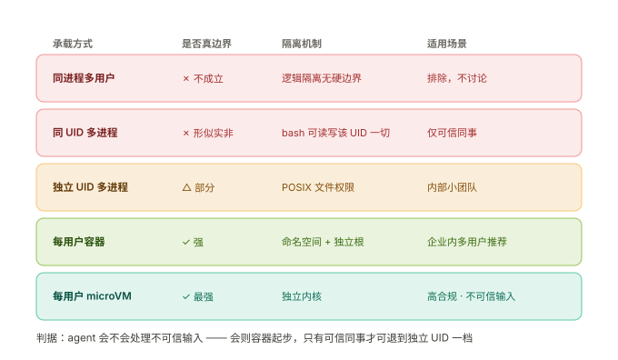
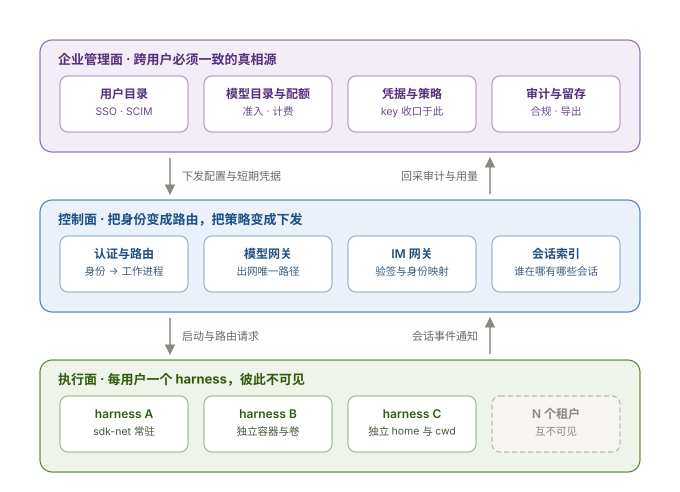
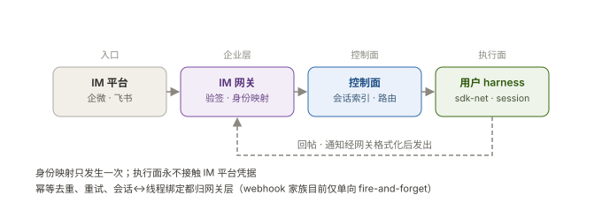
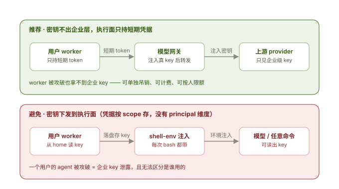
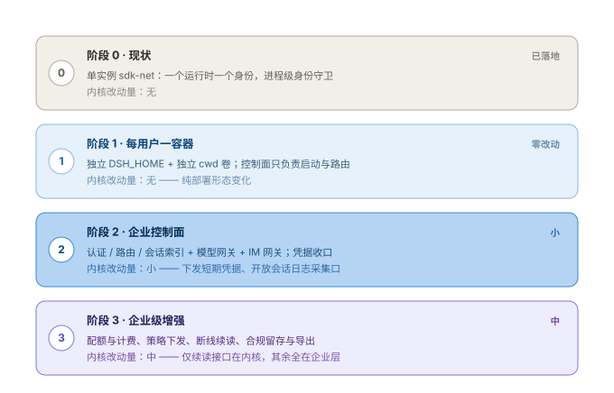

# 企业级部署：多租户、隔离边界与分层归属

> 源码设计分析笔记（单语维护，不承担 docs/ 的双语配对契约）。引用提交请用 tag 或 PR 链接，勿写裸 commit 哈希（repository-references 门禁）。
>
> 承接 [apps-architecture.md](apps-architecture.md)。那份回答"dsh 由哪些应用装配、能力面在哪、app-server 化要做什么"；这份回答"要把它交付给一个企业、企业内部还要分人时，边界切在哪一级、每项管理落在哪一层、按什么顺序做"。所有结论标注源码位置，可直接核对。

## 结论摘要

1. **共享的层级选对了，隔离就不必拆掉管理。** 被隔离的是"执行"，管理不必跟着拆。判据只有一条：**这个事实是不是跨用户必须一致**。
2. **单进程多用户结构性不成立**，不是工程难度问题——三条仓库自证（§1.2）。
3. **两级边界**：企业 = 部署单元；企业内用户 = 一个容器（或至少独立 UID + 文件权限）。
4. **管理能力分三层落**：跨用户真相 → 企业管理面；"身份变路由、策略变下发" → 控制面；只关一个人手上活儿的状态 → 他自己的 harness。
5. **不要给 harness 内核加 owner 维度。** 每用户独立实例 + 独立存储，归属留在控制面——内核零改动，且避开 session 那条严格的代际迁移规则。
6. **凭据必须收口**在模型网关/凭据代理，执行面只持短期凭据（§4.1）。
7. **演化是四级台阶**（§5）：阶段 1 内核零改动，今天就能做。

---

## 1. 前提：问题不是"能不能共享"，是"共享在哪一层"

### 1.1 一条判据

把"企业级需要一个能力"直接翻译成"往 harness 内核里加这个能力"，是这套设计里最容易走错的一步。真正要问的是：

> **这个事实，是不是跨用户必须一致？**

- **是**（谁能用、用多少、被允许做什么、审计留多久）→ 上提到企业管理面，由控制面下发。
- **否**（这个会话用哪个模型、启用了哪些工具、工作目录在哪）→ 留在那个人的 harness 里，本来就已经是 per-home 的。

这条判据能解释后面几乎所有归属决定。它也是"每用户一个 harness 不会导致管理失控"的依据——**管理面的真相根本不在执行面里**。

### 1.2 为什么单进程多用户不成立

不是"实现起来难"，而是**结构上不成立**。agent 能跑 shell、写文件、装依赖、拉代码，等价于"给用户任意代码执行"。三条来自仓库自身的证据：

| 证据 | 原文 | 含义 |
|---|---|---|
| `SAFETY.md` | 不要把 harness 当作不可信负载的**唯一安全控制**，优先用一次性 VM / 容器 / 专用环境 | 仓库自己划定了定位 |
| `packages/sandbox/sandbox/README.md` | "This is **same-world confinement**: the process still shares the host kernel and filesystem; use a container, microVM, or remote executor when the whole environment must be isolated." | 沙箱不是环境隔离 |
| `packages/sandbox/sandbox/README.md` | "After a denied call, the model can request **one strictly wider mode** for human approval." | 模式可被提升 |
| `packages/sandbox/sandbox-policy/README.md` | "Deployments choose a default mode and fallback workspace root, while **each session can switch modes independently**. Session choices survive restart." | **粒度是会话**，不是进程 |

第四条最致命：`sandbox` 有三种模式（`read-only` / `workspace-write` / `danger-full-access`），而**模式是按会话独立选择并可跨重启保留的**。一个进程服务多个用户时，用户 A 对自己会话的一次提权，落到文件系统上就能读到用户 B 的目录。这不需要任何漏洞，是设计意图的正常使用。

还有一条容易被忽略的补充证据——`packages/sandbox/sandbox-windows-acl/README.md` 明确写着自己**故意是部分保证**："The guarantee is intentionally partial because process startup retains Everyone access and NTFS hard links can expose the same file through another path." 连"同一台机器内的写权限收敛"都不是完全可靠的，更不用说拿它当多用户边界。

**"多进程隔离"与"执行面分租户"是假对立**：执行面分租户的实现手段本来就是进程 / 容器 / VM。真正的决策点只有两个——**边界切在企业级还是用户级**，以及**用什么承载**。

配套的一条澄清：**同一 UID 下的多进程不是安全边界**。agent 的 bash 能读写该 UID 能碰到的一切文件。所以"每用户一个进程"必须同时配**独立 UID + 文件权限**，否则只是看起来隔离了。

---

## 2. 两级边界与三层归属

### 2.1 两级边界

| 边界 | 含义 | 承载 | 满足什么 |
|---|---|---|---|
| **一级：企业** | 一个企业 = 一个独立部署单元 | 独立容器/集群 + 独立 `DSH_HOME` 根 + 独立网络出口 + 独立审计 | 数据驻留、计费、合规审计、租户间物理隔离 |
| **二级：企业内用户** | 一个用户 = 一个执行单元 | 一个容器（或至少独立 UID + 文件权限）+ 独立 `DSH_HOME` + 独立 cwd 卷 | 用户之间的文件、会话、凭据互不可见 |

两级都**不能靠逻辑隔离**，理由同 §1.2。

### 2.2 三层职责

- **企业管理面（跨用户真相源）**：用户目录（IdP/SSO/SCIM）、模型目录与配额、凭据与策略、审计与留存。这一层的"真相"不来自 harness，harness 只是它的下发对象。
- **控制面**：认证与路由、模型网关、IM 网关、会话索引。职责可以概括成两句话——**把身份变成路由，把策略变成下发**。它不存会话内容，也不执行 agent。
- **执行面**：每用户一个 harness 实例（`dsh --profile sdk-net`），持有该用户的会话、工作目录、工具执行与沙箱策略。

判据落在哪一层，看这个事实**是否需要跨用户一致**：需要的一致性是企业管理面的事，把一致性变成实际动作是控制面的事，某个人的实际工作是执行面的事。

---

## 3. 各管理域的归属分层

| 管理域 | 企业管理面持有的真相 | 留在用户 harness 的部分 | 仓库里已有的接缝 |
|---|---|---|---|
| 用户管理 | IdP / SSO / SCIM，组、入离职、禁用 | 无——harness 不该有 principal | ⚠️ 完全没有（见 §3.1） |
| 模型管理 | 可用模型目录、配额、计费归属、是否允许外部 provider | 本会话选哪个模型、reasoning effort、maxTokens | `agent-default-model`、`llm.registerAdapter` |
| 连接器管理 | 允许连哪些 MCP server / SaaS、企业共享凭据、谁可授权 | 启用了哪些连接器、哪些工具可见 | `mcp-client`（按 caller scope）、`agent-presets` |
| IM 管理 | bot 应用凭据、webhook 验签、**身份映射**、路由与去重 | 会话的真实内容与执行 | `webhook` / `webhook-github`（单向，见 §3.4） |
| 审查 | 审计库、留存策略、导出、法务冻结、**脱敏规则** | 只做**证据源** | `session` 持久化、`session-telemetry`、`session-telemetry-otel` |
| 安全 | 网络策略、镜像与供应链、KMS、出口控制、编排 | 仅纵深防御 | `browser-auth`、`api-request-trust` |

### 3.1 用户管理

**全部在企业层。** harness 里没有任何 principal 概念，也不该有。

必须点明的一处误用风险：`packages/identity/anonymous-user-id` 是**安装级**标识——"one anonymous identifier **per harness home**"，写在 `$DSH_HOME/.anonymous-user-id`，删掉文件就重新生成。它的用途是遥测与反馈关联，**不是用户身份**，不能拿来做鉴权或归属。

控制面对执行面的作用方式是**启动期**的：以某个企业身份启动一个 worker，把它对应的 `DSH_HOME`、cwd、部署配置和短期凭据交给它。之后 harness 内部仍然是"一个 home 一个用户"，不需要知道有别人存在。

### 3.2 模型管理

拆成两半：

- **企业层**：模型目录（准入哪些 provider/model）、配额、计费归属、是否允许直连外部 provider。
- **执行面**：本会话选哪个模型、reasoning effort、maxTokens。

现状里已经有现成的缝：`packages/core/agent-default-model/README.md` 明确写着默认模型是**进程级**的，而"**per-session model selection is the creating entry point's responsibility**"；`packages/llm/llm/src/index.ts` 的 `registerAdapter(providers[], adapter)` 允许**多个 provider 路由并存**。这两条合起来意味着"每用户/每会话不同模型"不需要新 LLM 基建，只需要入口点解析。

真正的企业级改造是**模型网关**：provider key 只留在网关，执行面拿短期 token + 网关地址。理由和做法见 §4.1。

### 3.3 连接器管理

这是最容易放错的一层，必须拆成两半：

| 半边 | 归属 | 说明 |
|---|---|---|
| **授权与凭据** | 企业层 | 允许连哪些 MCP server / SaaS、用企业共享凭据还是用户 OAuth、谁有权授权 |
| **启用与作用域** | 用户 harness | 这个用户启用了哪些连接器、哪些工具对他可见 |

执行面侧的两个现成机制：

- `packages/mcp/mcp-client/README.md`：一个条目录一个 server，工具名形如 `mcp__github__create_issue`，**默认不启用任何 server**，且"**An empty caller scope adds no MCP tools or prompt text**"——**scope 概念已经存在**，这正是按人裁剪工具面的天然入口。
- `packages/preset/agent-presets/README.md`：preset 声明一个会话的 tools、prompt sections 与 skills，"**One process can run sessions with different presets while keeping their state separate**"，且 preset 列表是"shipped definitions + configured and user roots"三者合并。

凭据怎么给到执行面，有两条路，安全性差一档：

1. **网关代理（推荐）**：worker 不持有 secret，调用经网关转发时注入。适用企业共享凭据。
2. **per-user OAuth 落个人 home**：`packages/credentials/authorization` 已支持人类引导式登录（"obtain credentials through a human-guided sign-in, code entry, or question"），且"Each attempt sends notices and prompts **only to the surface that started it**"。这条在多用户共享进程时是隐患（提示可能串台），但在每用户独立 worker 时反而变成优点。

### 3.4 IM 管理

**IM 不是"管理对象"，是入口 + 身份映射问题。** 企业层管的是"这条消息是谁发的、他该落到哪个 worker"，而不是"怎么记录 IM 会话"。

企业层/控制面承担：bot 应用凭据、webhook 验签、**IM 身份 → 企业用户 → 对应 worker 的映射**、会话（聊天线程 ↔ session）路由、幂等去重与重试、回帖格式化。

执行面只承担：该用户会话的真实内容与执行，通过 sdk-net 的 `initialize` / `session/prompt` / 通知完成。

仓库里已有的种子是 `packages/webhook/`：

- `webhook`：提供 `ctx.webhookRuntime`——可信规则注册表（`register(rule)` / `dispatch(delivery)`），内置唯一动作是**创建一个普通 root Session**。
- `webhook-github`：在 `ctx.webServer` 上注册一条精确 HTTP 路由，校验并限制 GitHub 的原始 JSON body，投影成 **provider-neutral delivery**，调用 `dispatch()`，**立即返回 202 而不等规则或 Session**。

两者合起来是"外部事件 → 会话"的**单向 fire-and-forget 通道**：没有投递队列、没有重试、没有去重、没有完成态回传，也没有 provider 出站回复适配层。更关键的是它是**单 home** 的——`dispatch` 直接在当前进程里建会话，没有"按身份选 worker"这一步。所以：

- 入站事件模型可复用（验签 + provider-neutral 投影 + 快速 ack 的形态是对的）；
- **跨用户路由必须在控制面**，不能指望 webhook 家族自己长出来。

### 3.5 审查

**真相与留存全在企业层**（审计库、留存策略、导出、法务冻结、脱敏规则）；执行面只做**证据源**。

三个可用的证据源，各有明确限制：

| 来源 | 能力 | 限制 |
|---|---|---|
| 会话持久化（`session-persistence` / `-jsonl`） | "preserving **contiguous append-only history**"；每会话一个日志，一个 root 目录即可配置 | 只在本机 home 里，企业层要自己去采集 |
| `session-telemetry` | 可对每份出站副本**脱敏**，下发非阻塞 | "Delivery is **best effort**, and queued records **may be lost if the process crashes**" |
| `session-telemetry-otel` | 经 OTel SDK 导出，可配 `FEEDBACK_ONLY` / `DISABLED` | "exports session records … **only after new explicit feedback**" |

结论很直接：**强审计不能只靠 telemetry**。要做合规级审计，得定期采集 append-only 的会话日志进不可变存储，telemetry 只当实时观测。另外注意 `session-telemetry` 是"Deployments choose **one** reporting backend"，所以每个用户 worker 应由控制面用**同一份** telemetry 配置启动，审计才会汇到同一个后端。

### 3.6 安全

分三层，重心不同：

- **企业层**：网络策略、镜像与供应链、KMS 与密钥轮转、出口控制（模型与连接器只能走网关）、容器/microVM 编排、镜像内的 harness 版本准入。
- **控制面**：认证与授权、按身份路由、限流与配额、给 worker 下发**短期**凭据。
- **执行面**：沙箱只是**纵深防御**，不是边界（§1.2）。

企业层还要就两个"能力自增"开关明确表态（§4.4）：preset 的编辑权与 `extensions` 的运行时动态定义权。

---

## 4. 关键考量

这一节列出几处"不看源码就会做错"的地方。

### 4.1 凭据必须收口（最不能妥协的一条）

两条硬证据：

1. `packages/credentials/credentials/src/index.ts` 的 `credentialKey(scope, id)` 构造的是 `<scope>/<id>`——**scope 是插件命名空间，没有 principal 维度**。也就是说凭据模型里根本没有"这是谁的钱/谁的权限"这一栏。
2. `packages/shell/shell-env/README.md`：它提供"the trusted `DSH_*` environment that **every model shell call — bash or pwsh — runs with**"，其中内置了 `DSH_HOME`。

第 2 条意味着两件事同时成立：**如果多个用户共享一个 home，模型随手执行的一条命令（`echo $DSH_HOME` 之后继续走）就能摸到别人的数据**；而如果 provider key 以环境值形式落在同一个 worker 里，那个用户的 agent 就能把它读走。

仓库自己已经给出过正确做法的先例——`packages/bundle/web-app/src/index.ts` 的注释写明了它注册"the process-token URL line"，同时"**The model and shell retain the clean URL**"：**凭据给浏览器用，但绝不进入模型视野**。把这条原则推到企业级，就是下面这句：

> **provider key 与连接器 secret 永不进入执行面；执行面只持短期、可按人吊销的凭据。**

正确的流向是：`用户 worker --(短期 token)--> 模型网关 --(注入真 key)--> 上游 provider`。

### 4.2 不要给 harness 内核加 owner 维度

这是本文最重要的取舍。企业级方案应当**绕开**"给 session/workspace 加 owner"这条路：

- `packages/workspace/workspace/src/spec.ts` 里 `WorkspaceRecord` 的字段是 `{ path, title, sessionIds, createdAt, updatedAt }`——**没有任何 owner/principal 字段**。（其中 `sessionIds` 是"workspace 拥有 session"的意思，那是唯一的 ownership 概念，与用户归属无关。）
- `AGENTS.md` 对会话格式有严格规则：相邻迁移"may add a version-named successor but never move, overwrite, or delete committed generations"。给 session 加 owner 维度意味着一次真实的格式迁移。
- `session-query` 一族的浏览/搜索/导出路径都要逐个加过滤，漏一处就是一个跨租户泄漏面。

**让每个用户拥有自己的 harness 实例和存储**，归属关系留在控制面的会话索引里，收益是三重的：内核零改动；避开代际迁移规则；从根上消灭跨租户查询泄漏面。代价是控制面要做一张"谁在哪个 worker 上有哪些会话"的索引——这是普通的业务表，比改内核存储格式便宜一个数量级。

### 4.3 `settings` 的三层合并就是现成的下发通道

`packages/settings/settings/README.md`：每个命名空间是"**schema defaults, deployment configuration, and user overrides**"三者合并，读取方拿到冻结快照；而**写入只影响 user overrides**，按命名空间串行化。

这正好是"**企业定基线、用户可调有限项**"的现成结构。企业级不需要新造配置下发机制，只需要：

1. 控制面生成**部署配置层**（即 profile/`cordis.yml` 的 patch 层）；
2. 决定哪些命名空间允许用户覆盖——不允许的就不暴露写入口。

配套事实：`settings-file` 把全部命名空间的用户设置放在 harness home 下的单个 YAML/JSON 文档（默认 `settings.yaml`），用户可直接编辑且**改动即时生效**；文档损坏时启动**大声失败**，但热重载失败会保留上次可用内容并告警。这对企业级是好事（坏配置不会静默生效），但也意味着**企业下发的配置文件必须由控制面校验后再落地**。

### 4.4 两个"能力自增"开关

企业级必须明确表态的两个边界，否则等于默认开放：

| 开关 | 源码依据 | 意味着什么 |
|---|---|---|
| **preset 编辑权** | `agent-presets`："Treat every authored preset as **trusted configuration** because it grants the capabilities of the plugins it selects." | 让用户自写 preset = 让用户给自己加能力 |
| **运行时动态定义** | `cordis-host-runner`：Host 半侧跑在 `node:vm` realm；"**Definitions disappear on restart**"；持久化要经 Plugin Manager | 用户能不能在运行时给自己插一段代码 |

另外 `packages/boot/plugin-manager` 的作用域是**按 profile** 的："**Changes affect every session using the profile.**" 在单用户实例里这没问题；一旦有人以为可以"一个 profile 服务多用户"，这条就是明确的否决。

### 4.5 认证现状：天然就是"一实例一用户"

好消息，且值得写清楚，因为它说明企业级是在一个干净地基上加层，而不是去改它。

- `packages/client/connection/src/browser-auth.ts`：浏览器会话认证由**每 home 一把 HMAC 密钥**（`credentialKey('client-connection', 'browser-session')`，32 字节随机）签发 cookie，cookie 载荷绑定 **authority**，带签发/过期时间，有效期 7 天，密钥本身存在 credentials 里。**这是每个实例一套的认证，不是每个用户一套。**
- `packages/client/connection/src/api-request-trust.ts`：`trustedHosts` 是一道**防 DNS rebinding / 跨站请求的围栏**，注释里写着它对认证的态度是明确的——"Network reachability and authentication stay out of scope … and **this fence is not an auth layer**."
- `packages/host/frontend-static/README.md`：索引访问需要"a valid **process token** or browser cookie"，而静态资源仍然公开。
- `packages/host/webserver/src/index.ts`：`node:http` 服务器，只提供命名路由、upgrade 路由和 fallback，"**knows no harness concepts**"——将来企业级要加 HTTP/WS 入口，复用它即可，不需要动内核。

把这些合起来看：**现有认证模型就是"一实例一用户"**，与"每人一个端"完全对齐。企业级要做的是在它**之上**叠 principal 与路由，而不是替换它。

### 4.6 客户端侧缺口：断线续读

sdk-net 的通知是**实时扇出、不补历史**。手机切后台、浏览器刷新、IM 长连接断开重连后，客户端拿不到断连期间的事件。

好消息是会话日志是 append-only 且**支持按位置读取**，天然支持回放；缺的只是"从某个 offset 续读"的接口。这是阶段 3 少数的**内核改动**之一，其余企业级能力都能留在企业层。

---

## 5. 演化路径

### 阶段 0 · 现状（已完成）

`packages/bundle/sdk-net` 提供 `dsh --profile sdk-net`：复用既有 SDK 能力面实现，加一层 TCP 监听壳，一个运行时服务多个客户端，`shutdown` 应答后退出。

其中有一条设计要特别注意它的**寿命**：进程级单身份守卫（`initialize` 用 cwd/provider/model/reasoningEffort/maxTokens 组成身份串，幂等重试放行、不同参数拒绝）。它把"一个运行时一个身份"从隐含假设变成显式契约——在阶段 1/2 下是**资产**，因为它让"越权换身份"变成一次明确的报错；只有在"单进程多租户"那条路上才会被推翻。这正是推荐走每用户实例路线的原因之一。

### 阶段 1 · 每用户一容器（内核零改动）

- 每用户一个容器 + 独立 `DSH_HOME` + 独立 cwd 卷；
- 控制面只做两件事：按身份启动 worker、把请求路由过去；
- 模型调用直连（key 暂时还在 worker 侧）——这是本阶段明确的**安全欠账**，用于换取"今天就能跑"。

产出：一个可用的、每人一端的内部服务。

### 阶段 2 · 企业控制面

- 认证与授权 → principal → worker 路由；
- **模型网关**：provider key 上收，执行面改持短期凭据；
- **IM 网关**：验签 + 身份映射 + 线程绑定 + 幂等去重；
- **会话索引**：谁在哪个 worker 上有哪些会话；
- **审计采集**：拉取 append-only 会话日志，telemetry 作实时观测。

内核改动量：小——需要支持"用短期凭据替换静态 key"（`llm.registerAdapter` 允许自定义路由，改 adapter 或加一层注入即可），以及暴露一个会话日志采集出口。

### 阶段 3 · 企业级增强

- 配额与计费（按 principal 聚合用量）；
- 策略下发（`settings` 部署配置层）；
- **断线续读**（客户端按 offset 回放）；
- 合规留存与导出、法务冻结、保留/销毁策略。

内核改动量：中——续读接口在内核；其余全在企业层。

### 一条反直觉但值得采纳的顺序建议

**先做阶段 1，不要先做"控制面框架"。** 阶段 1 用一次部署形态变化换来真实反馈（谁在用、怎么用、瓶颈在哪），而它零内核改动、可随时回退。控制面如果先建，很容易照着想象中的需求长出复杂度；等阶段 1 跑起来，会话索引该有哪些字段、配额按什么维度切，都会有真实依据。

---

## 6. 现状体检：已有 / 要建

| 能力 | 现状 | 位置 |
|---|---|---|
| 每用户独立实例 | ✅ 已具备 | `dsh --profile sdk-net`（`packages/bundle/sdk-net`） |
| 独立存储根 | ✅ 已具备 | `DSH_HOME`（`packages/util/home-paths`），默认 `~/.dsh` |
| 单实例认证 | ✅ 已具备（每实例一套） | `browser-auth.ts` 的 HMAC cookie + process token |
| 配置分层下发 | ✅ 已具备 | `settings` 的三层合并；`settings-file` 落 home |
| 按 scope 裁剪工具面 | ✅ 已具备 | `mcp-client` 的 caller scope |
| 每会话能力包 | ✅ 已具备 | `agent-presets` |
| 多 provider 路由 | ✅ 已具备 | `llm.registerAdapter(providers[], adapter)` |
| 会话日志（可回放） | ✅ 已具备 | `session-persistence-jsonl`，append-only |
| 遥测与脱敏出口 | ✅ 已具备（best-effort） | `session-telemetry` / `-otel` |
| 企业用户目录 / principal | ❌ 完全没有 | 需企业层自建（对接 IdP） |
| 认证 → 路由（控制面） | ❌ 没有 | 需新建；可复用 `host/webserver` 做载体 |
| 模型网关 | ❌ 没有 | 需新建；执行面需支持短期凭据 |
| IM 入站事件模型 | ⚠️ 部分（单向、单 home） | `packages/webhook/`（`webhook` + `webhook-github`） |
| IM 身份映射与出站回复 | ❌ 没有 | 需新建（控制面 + provider 适配层） |
| 会话索引（跨 worker） | ❌ 没有 | 需新建（控制面业务表） |
| 审计采集与留存 | ❌ 没有 | 需新建（采集 append-only 日志） |
| 配额与计费 | ❌ 没有 | 需新建；凭据按 scope 存，须自行加 principal 维度 |
| 断线续读 | ❌ 没有 | 需内核补一个按 offset 续读的接口 |
| 沙箱作为安全边界 | ❌ 不成立（设计如此） | 由容器/microVM 承担 |

---

## 7. 企业层对 harness 的契约面

好消息是这份契约很小。企业层需要 harness 提供的只有四件事：

1. **启动**：给定 `DSH_HOME`、cwd、部署配置、短期凭据，把 worker 拉起来；
2. **驱动**：通过 sdk-net 的 JSON-RPC（`initialize` / `session/prompt` / `shutdown` + 通知）发起与跟随会话；
3. **审计**：读取 append-only 的会话日志（＋可选的 telemetry 出口）；
4. **健康**：就绪与存活探针。

**不需要**的：admin API、用户表、配额表、审计表。这些一旦进 harness，就等于把 §4.2 那条"不要在核心里加 owner 维度"重新打开了。控制面与执行面之间的耦合面越窄，两边的演化就越自由。

---

## 8. 不确定点

1. **短期凭据怎么落到 `llm` 层**：`registerAdapter` 允许自定义适配器，但"按请求注入短期 token 且自动续期"的具体接法未逐一验证（可能需要包一层 provider 或改 baseURL/鉴权头注入点）。
2. **`session-query` 的实际查询面**：本文按"浏览/搜索/导出无租户过滤"判断，但未逐个方法核对——在"每用户独立实例"路线下这不构成风险，仅在转向单进程多租户时才需要精确清单。
3. **`webhook` 的规则模型是否足以承载 IM 出站**：入站侧的验签 + 快速 ack 形态是对的，但出站回复、线程绑定、重试队列都没有，需要新造；新造应放在控制面还是作为独立 bundle，未定。
4. **`shell-env` 的 `DSH_*` 事实集**：本文只确认了 `DSH_HOME` / `DSH_SHELL` / `DSH_SESSION_ID` 三项内置，其余插件注册项未穷举；企业级下发凭据时需确认没有别的 `DSH_*` 会泄漏敏感值。
5. **多用户共享一台机器的资源争抢**：容器密度、CPU/内存/磁盘配额、并发模型调用的连接数，均未评估。

---

## 附录：源码坐标

| 主题 | 位置 |
|---|---|
| 安全定位声明 | `SAFETY.md` |
| 沙箱三模式与提权路径 | `packages/sandbox/sandbox/README.md` |
| 沙箱按会话切换模式 | `packages/sandbox/sandbox-policy/README.md` |
| 平台沙箱的部分保证 | `packages/sandbox/sandbox-local/README.md`、`packages/sandbox/sandbox-windows-acl/README.md` |
| harness home 解析 | `packages/util/home-paths` |
| 工作区记录形状（无 owner） | `packages/workspace/workspace/src/spec.ts` |
| 安装级匿名标识 | `packages/identity/anonymous-user-id/README.md` |
| 凭据键与作用域 | `packages/credentials/credentials/src/index.ts` |
| 人类引导式授权 | `packages/credentials/authorization/README.md` |
| 设置三层合并 | `packages/settings/settings/README.md`、`packages/settings/settings-file/README.md` |
| 默认模型与每会话选择 | `packages/core/agent-default-model/README.md` |
| provider 注册 | `packages/llm/llm/src/index.ts` |
| MCP 连接器与 scope | `packages/mcp/mcp-client/README.md`、`packages/mcp/mcp-resources/README.md` |
| 会话能力包 | `packages/preset/agent-presets/README.md`、`packages/preset/persona/README.md` |
| 外部事件入站 | `packages/webhook/webhook/README.md`、`packages/webhook/webhook-github/README.md` |
| 会话持久化语义 | `packages/session/session-persistence/README.md`、`packages/session/session-persistence-jsonl/README.md` |
| 遥测与脱敏 | `packages/session/session-telemetry/README.md`、`packages/session/session-telemetry-otel/README.md` |
| 浏览器认证 | `packages/client/connection/src/browser-auth.ts` |
| 请求信任围栏（非认证） | `packages/client/connection/src/api-request-trust.ts` |
| HTTP 载体 | `packages/host/webserver/src/index.ts`、`packages/host/frontend-static/README.md` |
| 模型与 shell 保留干净 URL | `packages/bundle/web-app/src/index.ts` |
| 模型 shell 的 `DSH_*` 环境 | `packages/shell/shell-env/README.md` |
| 运行时动态定义 | `packages/extensions/cordis-host-runner/README.md` |
| profile 级插件管理 | `packages/boot/plugin-manager/README.md` |
| 会话格式代际规则 | `AGENTS.md` |
| 网络能力面（本文的执行面载体） | `packages/bundle/sdk-net`、`packages/sdk/server`、`packages/sdk/protocol` |
